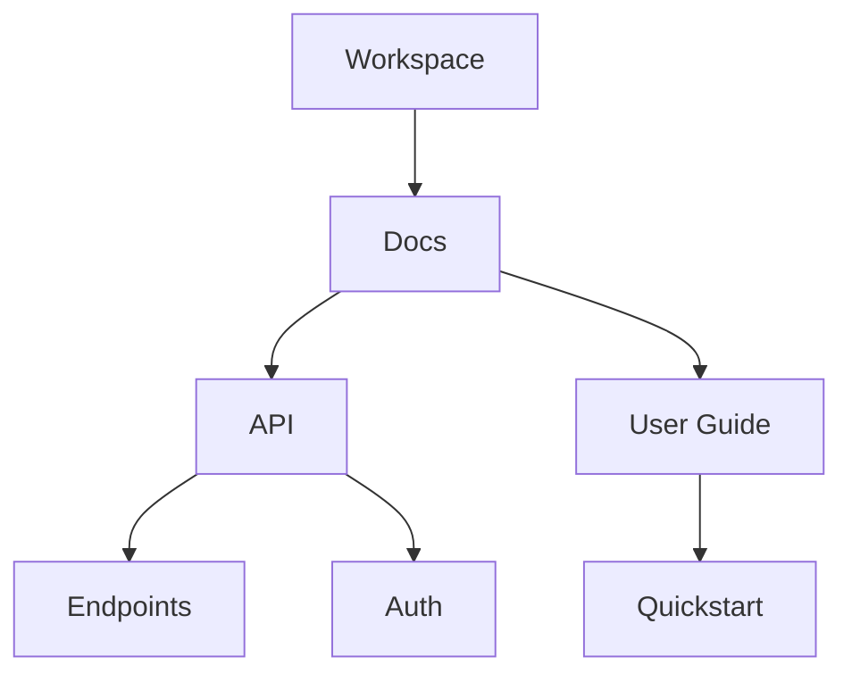

## Overview

Espridigital provides powerful tools to manage your project documentation efficiently. You organize content into hierarchical structures, collaborate in real-time, search across all documents, and track changes with full versioning. These features ensure your team stays aligned and productive.

<Columns cols={2}>
  <Card title="Document Hierarchy" icon="layers" href="#document-hierarchy">
    Build nested folders and pages for intuitive navigation.
  </Card>
  <Card title="Real-time Collaboration" icon="users" href="#collaboration">
    Edit documents simultaneously with others.
  </Card>
  <Card title="Advanced Search" icon="search" href="#search">
    Find content instantly across your workspace.
  </Card>
  <Card title="Version History" icon="git-branch" href="#versioning">
    Track and revert changes with confidence.
  </Card>
</Columns>

## Document Organization and Hierarchy

Create a clear structure for your documentation using folders, subpages, and custom hierarchies. You drag and drop pages to reorganize, set permissions per folder, and use tags for cross-referencing.

### Setting Up Your Hierarchy

<Steps>
  <Step title="Create Folders" icon="folder">
    Navigate to your workspace root and click the `+ New Folder` button. Name it `API Reference`.
  </Step>
  <Step title="Add Pages" icon="file-text">
    Inside the folder, create pages like `Endpoints` and `Authentication`. Use the outline view to nest them.
  </Step>
  <Step title="Organize with Drag-and-Drop">
    Rearrange pages by dragging them into subfolders. Apply tags like `internal` for quick filtering.
  </Step>
</Steps>



<Callout kind="tip">
  Use the `{folder_id}` in API calls to reference hierarchies programmatically.
</Callout>

## Collaboration and Real-time Editing

Invite team members to co-edit documents live. You see changes as they happen, with cursor indicators and conflict resolution.

<Tabs>
  <Tab title="Invite Collaborators" icon="user-plus">
    Go to document settings and add emails. Set roles: `editor`, `viewer`, or `admin`.
  </Tab>
  <Tab title="Real-time Edits" icon="edit-3">
    Multiple users edit simultaneously. Changes sync in `<1s`.
  </Tab>
</Tabs>

<CodeGroup tabs="JavaScript,Python">
  ```javascript
  // Fetch collaborators via API
  const collaborators = await fetch('https://api.espridigital.com/v1/docs/{doc_id}/collaborators', {
    headers: { Authorization: `Bearer ${YOUR_API_KEY}` }
  }).then(res => res.json());
  ```
  ```python
  # Fetch collaborators via API
  import requests
  response = requests.get(
      'https://api.espridigital.com/v1/docs/{doc_id}/collaborators',
      headers={'Authorization': f'Bearer {YOUR_API_KEY}'}
  )
  collaborators = response.json()
  ```
</CodeGroup>

## Search Functionality and Content Discovery

Espridigital's search indexes all content, including titles, body text, and tags. You filter by folder, date, or author for precise results.

| Feature | Description | Example Query |
|---------|-------------|---------------|
| Full-text | Matches words anywhere | `OAuth flow` |
| Filters | Narrow by type/location | `folder:API status:active` |
| Advanced | Boolean operators | `auth AND (JWT OR OAuth)` |

<Callout kind="info">
  Search supports fuzzy matching, so `autentication` finds `authentication`.
</Callout>

## Versioning and History Tracking

Every edit creates a version. You view diffs, restore previous states, and branch for experiments.

<Expandable title="Advanced Versioning Workflow" default-open="false">

  1. Click `History` on any document.
  2. Select a version and `Compare` or `Restore`.

  Use the API for automation:

````javascript
// Revert to specific version
await fetch('https://api.espridigital.com/v1/docs/{doc_id}/versions/{version_id}/restore', {
  method: 'POST',
  headers: { Authorization: `Bearer ${YOUR_API_KEY}` }
});
````

</Expandable>

These features integrate seamlessly, letting you scale documentation from solo projects to enterprise teams. Start by organizing your first folder today.